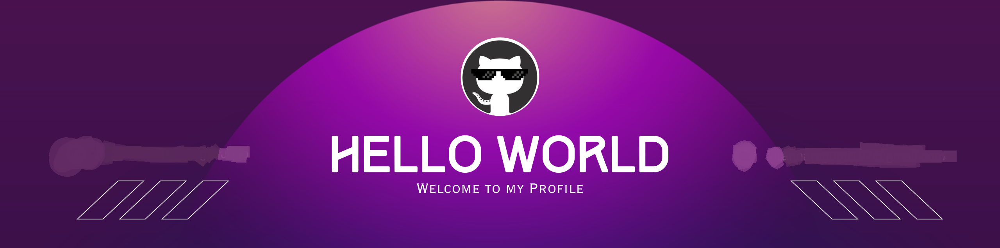

<!-- 🌟 ANIMATED BANNER WITH GLOW EFFECT -->

  

<!-- 🎨 CUSTOM BANNER IMAGE - MULTIPLE OPTIONS -->

  <!-- Option 1: Current Banner -->
  <!--  -->
  
  <!-- Option 2: Custom SVG Banner (Uncomment to use) -->
  
 
 
  
  <!-- Option 3: Modern Gradient Banner -->
  
  
  <!-- Option 4: Tech-Inspired Banner -->
  <!--  -->
  
  <!-- Option 5: Purple Gradient Banner -->
  <!--  -->
  
  <!-- Option 6: Matrix-Style Banner -->
  <!--  -->
  
  <!-- Option 7: Neon Glow Banner -->
  <!--  -->
  
  <!-- Option 8: Flutter Developer Banner -->
  <!--  -->
  
  <!-- Option 9: IoT Tech Banner -->
  <!--  -->
  
  <!-- Option 10: Animated Code Banner -->
  <!--  -->
  
  <!-- Option 11: Custom Purple Theme Banner -->
  <!--  -->

<!-- 🎨 ALTERNATIVE BANNER OPTIONS (Uncomment the one you prefer) -->
<!--

  <h3 style="color: #8E67E4; margin: 20px 0;">🎨 Choose Your Banner Style:</h3>

<!-- 🎨 PREMIUM BANNER OPTIONS -->
<!--

  <h3 style="color: #8E67E4; margin: 20px 0;">🌟 Premium Banner Collection:</h3>

  <!-- Option A: Flutter Developer Theme -->

<!-- ✨ FLOATING PARTICLES EFFECT -->

  

<!-- 🎭 FLOATING ANIMATED ELEMENTS -->

  

<!-- 🎪 HERO SECTION WITH ANIMATED EMOJI -->
<h1 align="center">
  
  
  
</h1>

<!-- 🌟 ANIMATED INTRO WITH GLOW EFFECT -->

  <h2 style="color: #8E67E4; text-shadow: 0 0 20px rgba(142, 103, 228, 0.5);">🚀 Tôn Thất Nam Giao</h2>
  <h3 style="color: #c56a90; text-shadow: 0 0 15px rgba(197, 106, 144, 0.4);">🎯 Full-Stack Developer | Mobile App Creator | IoT Innovator</h3>
  
  

    <strong style="color: #ffeb95;">🔥 Currently:</strong> Building next-gen fitness apps & IoT solutions 
    <strong style="color: #ffeb95;">🎓 Education:</strong> Final Year CS Student @ <b>Hue University of Sciences</b> 
    <strong style="color: #ffeb95;">🌟 Mission:</strong> Transforming ideas into digital reality
  

<!-- 🏆 ANIMATED BADGES WITH GLOW -->

  
  
  

<!-- 💫 ANIMATED QUOTE WITH GLOW -->

  

<!-- 🔗 PORTFOLIO LINK WITH ANIMATION -->

  

    🔗 <b style="color: #8E67E4;">Portfolio / CV:</b> 
    
  

---

<!-- 🎯 ABOUT ME WITH ANIMATED ICONS -->

## 🎯 About Me

  <table style="border-collapse: separate; border-spacing: 20px;">
    <tr>
      <td width="50%" style="background: linear-gradient(135deg, rgba(142, 103, 228, 0.1), rgba(197, 106, 144, 0.1)); border-radius: 15px; padding: 20px; border: 1px solid rgba(142, 103, 228, 0.3);">
        <h3 style="color: #8E67E4; text-align: center; margin-bottom: 15px;">🎓 Academic Journey</h3>
        
4th-year Computer Science student at Hue University of Sciences, specializing in software engineering and mobile development.

      </td>
      <td width="50%" style="background: linear-gradient(135deg, rgba(197, 106, 144, 0.1), rgba(255, 235, 149, 0.1)); border-radius: 15px; padding: 20px; border: 1px solid rgba(197, 106, 144, 0.3);">
        <h3 style="color: #c56a90; text-align: center; margin-bottom: 15px;">🚀 Professional Focus</h3>
        
Building end-to-end applications with focus on Flutter, React, and IoT solutions. Passionate about creating user-centric experiences.

      </td>
    </tr>
    <tr>
      <td width="50%" style="background: linear-gradient(135deg, rgba(255, 235, 149, 0.1), rgba(142, 103, 228, 0.1)); border-radius: 15px; padding: 20px; border: 1px solid rgba(255, 235, 149, 0.3);">
        <h3 style="color: #ffeb95; text-align: center; margin-bottom: 15px;">🛠️ Technical Expertise</h3>
        
Full-stack development with emphasis on mobile apps, Firebase integration, and real-time data visualization.

      </td>
      <td width="50%" style="background: linear-gradient(135deg, rgba(148, 163, 184, 0.1), rgba(197, 106, 144, 0.1)); border-radius: 15px; padding: 20px; border: 1px solid rgba(148, 163, 184, 0.3);">
        <h3 style="color: #94a3b8; text-align: center; margin-bottom: 15px;">🌟 Future Vision</h3>
        
Exploring AI/ML integration, cloud architecture, and contributing to open-source projects that make a difference.

      </td>
    </tr>
  </table>

---

## 🛠️ Tech Arsenal

  <h3 style="color: #8E67E4; text-shadow: 0 0 10px rgba(142, 103, 228, 0.3);">🔥 Core Technologies</h3>
  
  
  <h3 style="color: #c56a90; text-shadow: 0 0 10px rgba(197, 106, 144, 0.3);">🚀 Currently Mastering</h3>
  
  
  <h3 style="color: #ffeb95; text-shadow: 0 0 10px rgba(255, 235, 149, 0.3);">🎨 Design & Tools</h3>
  

<!-- 🎨 SKILLS ANIMATION -->

  <h3 style="color: #8E67E4; margin: 30px 0;">🎭 Skills in Action</h3>
  

### 📚 Learning Roadmap

- **🎯 Advanced Flutter**: State management, custom widgets, performance optimization
- **🌐 Full-Stack Mastery**: Node.js, Express, MongoDB, PostgreSQL
- **☁️ Cloud & DevOps**: AWS, Docker, CI/CD pipelines
- **🤖 AI/ML Integration**: TensorFlow, Python, data science fundamentals

---

## 🚀 Featured Projects

  <h2 style="color: #8E67E4; text-shadow: 0 0 15px rgba(142, 103, 228, 0.4);">🔥 Latest Creations</h2>

<table>
  <tr>
    <td width="50%">
      <h3 align="center" style="color: #c56a90;">🏭 IoT Farm Monitoring System</h3>
      

        
        
<strong>Tech Stack:</strong> React, Firebase, IoT, Real-time Data

        
<strong>Features:</strong> Sensor monitoring, device management, cloud integration

      

    </td>
    <td width="50%">
      <h3 align="center" style="color: #ffeb95;">💪 Fitness Tracking App</h3>
      

        
        
<strong>Tech Stack:</strong> Flutter, Firebase, iOS/Android

        
<strong>Features:</strong> Workout tracking, progress analytics, social features

      

    </td>
  </tr>
</table>

  <h3 style="color: #8E67E4;">🎯 More Projects</h3>
  

---

## 🏆 Achievements & Analytics

  <h2 style="color: #8E67E4; text-shadow: 0 0 15px rgba(142, 103, 228, 0.4);">🌟 GitHub Trophies</h2>
  <picture>
    

  </picture>

<table width="100%">
  <tr>
    <td width="50%">
      <h3 align="center" style="color: #c56a90;"><strong>📊 GitHub Statistics</strong></h3>
      

        
      

    </td>
    <td width="50%">
      <h3 align="center" style="color: #ffeb95;"><strong>🔥 Contribution Streak</strong></h3>
      

        
      

    </td>
  </tr>
</table>

  <h3 style="color: #8E67E4;">📈 Activity Graph</h3>
  

  <h3 style="color: #c56a90;">💻 Most Used Languages</h3>
  

---

## 🌟 Daily Motivation

  

---

## 🤝 Let's Connect

  <h3 style="color: #8E67E4; text-shadow: 0 0 10px rgba(142, 103, 228, 0.3);">💬 Get In Touch</h3>
  
I'm always open to discussing new projects, creative ideas, or opportunities to be part of your visions.

  
  

    
    
    
    
    
    
  

  
  <!-- Alternative badges for better visibility -->
  

    
    
    
    
  

---

<!-- 🎪 ANIMATED FOOTER -->

  

